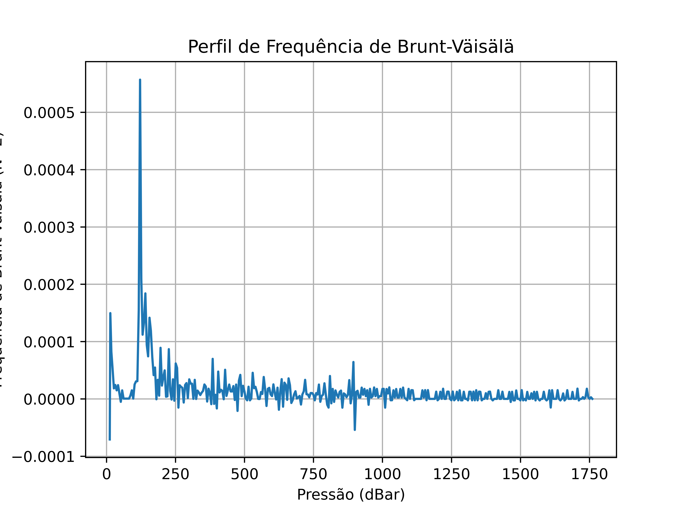

<h1 align="center"> Internal Waves </h1>

# Descrição
Projeto para calcular a frequência de Brunt-vaisalla para ser usado na identificação de ondas internas.
É utilizado o toolbox GSW (Gibbs SeaWater) para calcular a salinidade absoluta, temperatura conservativa e por fim a frequência de flutuabilidade.

O código consiste de três funções: bruntvaisala, plotvaisala e timecounter

- bruntvaisala: calcula a salinidade absoluta a partir da salinidade prática, temperatura conservativa a partir da salinidade absoluta e temperatura in situ, retorna uma tupla com N2 e pressão;
- plotvaisala: plota o gráfico da frequência de flutuabilidade (N2) em função da pressão;
- timecounter: executa todas as funções cronometrando seu tempo de resposta.

# Exemplo
Exemplo abaixo da imagem gerada depois de todas as funções serem executadas:

